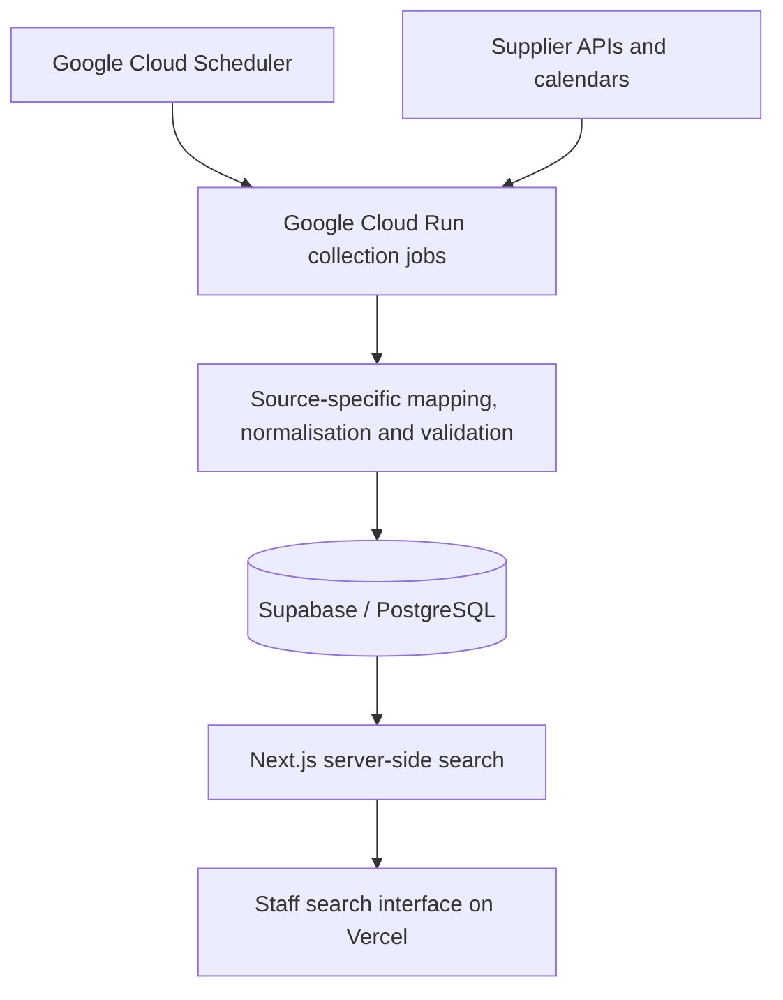

# Travel Availability Platform

**Commercial engineering case study · Private client application**  
**Developer:** Nate Colby · Méllon Software Studio

I built and maintain a staff-facing travel application covering **400+ properties**. It brings availability from independent supplier systems into one workflow, helping staff compare accommodation options for a requested destination, stay and room requirement.

The project combines a Next.js application, Supabase/PostgreSQL storage, supplier integrations and scheduled Google Cloud collection jobs. This case study describes the product and engineering approach; client source code and the application itself remain private.

## The problem

Availability information was spread across different booking systems, calendar formats and inventory definitions. Staff needed a consistent way to find accommodation options for client travel enquiries.

Bringing those sources together required more than collecting calendar values. A supplier might provide exact room counts, property-level totals or only an open/closed signal. Availability also had to be interpreted across a complete stay, with enough context for staff to understand the result.

## My role

I worked directly with the client from requirements and scoping through application development, deployment and ongoing maintenance. My responsibilities included the staff search experience, supplier integration work, data modelling and scheduled collection infrastructure.

I used Codex to assist with implementation, debugging, testing and deployment work. My role included defining requirements, prioritising changes and making scope and release decisions. This was an AI-assisted development workflow.

## What the application does

1. Staff enter a destination, arrival and departure dates, and the number of rooms required.
2. The application searches collected supplier availability for the requested stay.
3. Results show matching properties, room-type detail where supported, and update timestamps.
4. Staff can explore nearby date alternatives and search again for the same stay length.

The application supports accommodation search and planning. Reservations are completed through the relevant booking process outside this application.

## Interface example

*Portfolio excerpt using the application's interface patterns with fictional property names, inventory, dates and update times. It is not a live production screenshot.*

## Architecture

This is a simplified view of the system documented in the project records. Collection and search are separate: scheduled jobs prepare availability data, while the application reads that data for staff enquiries. Supported integrations can also perform additional supplier checks at search time.

| Layer | Technologies and responsibility |
| --- | --- |
| Application | Next.js, TypeScript/JavaScript — search forms, results and flexible-date options |
| Data | Supabase/PostgreSQL — shared property, date and room-availability data |
| Collection | Source-specific API/calendar integrations and Playwright where browser automation is needed |
| Scheduling | Google Cloud Run and Cloud Scheduler — container execution and scheduled collection |
| Application hosting | Vercel |

## Engineering decisions

### Preserve the meaning of supplier data

Different sources provide different levels of detail. The data and presentation distinguish exact counts, aggregate availability and open/closed signals. Where a quantity is not established, the interface asks staff to confirm it rather than displaying an invented count.

This makes source capability part of the result, instead of hiding it behind one uniform number.

### Check the requested stay

Availability on separate nights does not automatically establish that the same room or room category is available throughout a stay. Supported integrations include continuity and eligibility checks for the selected dates, with additional supplier verification where required.

These checks depend on what each integration can establish; they are not a guarantee that every supplier provides identical booking evidence.

### Make freshness visible

Collection happens separately from search, so stored data can age between refreshes. Results expose update timestamps, while collection outcomes and coverage checks support maintenance and diagnosis.

An update timestamp provides useful context. It does not guarantee that every date or supplier is current, and a failed collection request does not by itself prove that a property is sold out.

### Treat collection as an ongoing operational responsibility

Supplier formats and behaviour can change. Maintenance includes investigating failed collections, validating mappings and inventory, checking date coverage and applying regression checks when integration behaviour changes.

Validation is source-specific. The presence of these mechanisms does not establish universal uptime or a particular refresh success rate.

## Delivered result

The application provides one staff workflow for searching accommodation across **400+ properties**, comparing room availability and exploring nearby dates. It connects the user interface, collected data and scheduled infrastructure in a maintained commercial system.

The property count describes confirmed application scope, not the number successfully refreshed in every collection cycle. No measured time-saving, revenue increase or uptime percentage is claimed here.

## What this project demonstrates

- Turning client requirements into a usable business application.
- Connecting frontend search, database models and external supplier data.
- Handling differing inventory semantics and incomplete source information.
- Deploying and maintaining scheduled collection infrastructure.
- Using AI-assisted development while retaining responsibility for requirements and delivery decisions.

## About this repository

This repository contains public case-study documentation and an anonymised interface image. It contains no application source code, client data or live demonstration. The client is intentionally unnamed.

## Contact

[LinkedIn](https://www.linkedin.com/in/nate-colby/) · [Méllon](https://mellonaiagency.com/) · [Email](mailto:nate@mellonaiagency.com)
